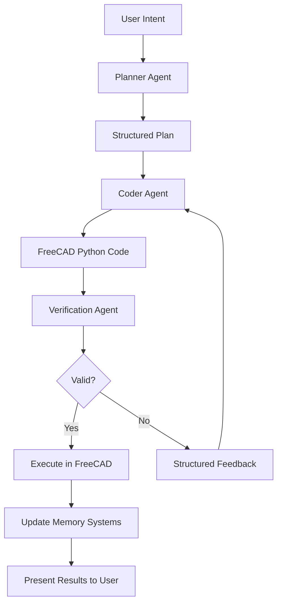

# FreeCAD AI Addon: Cognitive Scaffolding for Intelligent CAD

A revolutionary AI-powered design assistant that brings intelligent, context-aware automation to FreeCAD through advanced cognitive scaffolding and multi-agent architecture. This addon transforms the way engineers and designers interact with parametric CAD, providing an intelligent co-pilot that understands both the technical intricacies of FreeCAD's B-Rep geometry kernel and the semantic intentions behind human design decisions.

## 🧠 Cognitive Scaffolding Architecture

### The Intelligence Behind the Interface

Unlike traditional AI assistants that rely on simple text-to-code translation, this addon implements a sophisticated **cognitive scaffolding** approach that addresses the fundamental semantic gap between human design intent and CAD system precision. Our architecture recognizes that successful AI integration in parametric CAD requires more than pattern matching—it demands deep understanding of:

- **Parametric Design Paradigm**: Working within FreeCAD's feature-based, constraint-driven modeling environment
- **Geometric Reasoning**: Leveraging FreeCAD's Open CASCADE kernel for precise B-Rep operations
- **Design Intent Preservation**: Maintaining the "why" behind design decisions, not just the "what"
- **Long-term Context**: Building and maintaining awareness across complex, multi-step design processes

### 🤖 Multi-Agent Intelligence System

Our system employs specialized AI agents, each optimized for specific aspects of the design process:

#### **Planner Agent** - Strategic Reasoning & Intent Understanding
- **Role**: Translates ambiguous human requests into structured, executable design plans
- **Capabilities**: 
  - Natural language understanding and requirements analysis
  - Interactive clarification and missing information gathering
  - Chain-of-thought reasoning for complex decomposition
  - Design for Manufacturing (DFM) awareness

### 🏭 Manufacturing Advisor (materials, processes, cost)

- In FreeCAD, switch to the "AI Assistant" workbench.
- Menu/Toolbar: AI Assistant → "Manufacturing Advice".
- Select a part (optional), enter a quantity, and review:
  - Recommended materials and processes with scores/lead time
  - Cost estimate breakdown and DFM recommendations
  - Risks and suggested timeline

Optional Python API (outside FreeCAD GUI):

```python
from freecad_ai_addon.advanced_features import ManufacturingAdvisor

advisor = ManufacturingAdvisor(mock_mode=True)
advice = advisor.analyze_manufacturability(object_name="Bracket", quantity=25)
print(advice.summary)
```
#### **Coder Agent** - API Specialist & Code Generation
- **Role**: Converts atomic design goals into precise FreeCAD Python scripts
- **Capabilities**:
  - Fine-tuned on FreeCAD API patterns and idioms
  - Context-aware code generation with geometric validation
  - Constraint-solver integration for sketch operations
  - Parametric modeling best practices

#### **Verification Agent** - Quality Assurance & Feedback Loop
- **Role**: Ensures geometric validity and provides corrective feedback
- **Capabilities**:
  - Sandboxed execution in headless FreeCAD instances
  - Symbolic verification (syntax, API correctness)
  - Geometric validation (manifold solids, constraint satisfaction)
  - Iterative refinement through structured feedback

### 🧠 Advanced Memory & Context Management

#### Hybrid Memory Architecture
- **Working Memory**: Dynamic context construction with token-efficient representation
- **Episodic Memory**: Complete interaction history with temporal relationships
- **Semantic Memory**: B-Rep knowledge graph capturing design intent and dependencies
- **Procedural Memory**: Learned workflows and user-specific design patterns

#### Proactive Context Engineering
- **RAG-Enhanced Knowledge**: Real-time retrieval of relevant API documentation and examples
- **State-Aware Operations**: Full awareness of current document topology and constraints
- **Geometric Context**: Understanding of spatial relationships and manufacturing constraints
- **Design History**: Maintaining causal relationships between operations and decisions

## 🎯 Revolutionary Features

### 💡 **Intelligent Design Partnership**
Beyond simple command execution—true collaborative design thinking:
- **Intent-driven modeling**: "Create a mounting bracket for this motor" → Complete parametric solution
- **Proactive suggestions**: AI anticipates next logical steps and manufacturing considerations
- **Design optimization**: Automatic DFM analysis and improvement recommendations
- **Error prevention**: Predictive validation prevents topological naming problems

### 🔄 **Constraint-Solver Integration**
Leverages FreeCAD's mathematical precision while providing AI accessibility:
- **Geometric reasoning delegation**: AI formulates problems, solver calculates solutions
- **Sketch intelligence**: Automatic constraint application for fully-determined sketches
- **Parametric relationships**: Understanding and manipulation of feature dependencies
- **Topological stability**: Robust handling of model history and feature references

### 🌐 **Multi-Modal Interaction**
Flexible input methods for natural design communication:
- **Natural Language**: Conversational design specification and modification
- **Visual Context**: Integration with FreeCAD's visual state and selections
- **Mixed Initiative**: Both human and AI can initiate design actions
- **Sketch Input**: Future support for hand-drawn concept integration

### 🔍 **Explainable AI (XAI)**
Complete transparency in AI decision-making:
- **Design rationale tracking**: Every feature linked to its original justification
- **Source citation**: All API recommendations traced to official documentation
- **Plan visualization**: Step-by-step breakdown before execution
- **Failure analysis**: Detailed explanation of errors and correction strategies

## 🏗️ Current Development Status

### ✅ **Phase 1-2: Foundation & Intelligence Core** (Completed)

**Robust Infrastructure**
- ✅ Complete FreeCAD addon architecture with proper module organization
- ✅ Enterprise-grade security with encrypted credential management
- ✅ Comprehensive Model Context Protocol (MCP) integration
- ✅ Multi-provider AI support (OpenAI, Anthropic, Ollama, custom endpoints)

**Intelligence Framework**
- ✅ **Context Engineering System**: Dynamic context construction with state awareness
- ✅ **FreeCAD Deep Integration**: Complete document topology extraction
- ✅ **Geometric Analysis Engine**: B-Rep structure understanding and constraint tracking
- ✅ **Memory Architecture Foundation**: Episodic logging and semantic knowledge graphs

**Quality Assurance**
- ✅ **Verification Framework**: Sandboxed execution with geometric validation
- ✅ **Error Recovery Systems**: Structured feedback loops for iterative improvement
- ✅ **Testing Infrastructure**: Comprehensive test suites for all components

### 🔧 **Current Cutting-Edge Capabilities**

1. **Advanced AI Provider Integration**:
   - OpenAI GPT models (3.5, 4, 4-Turbo) with function calling
   - Anthropic Claude family (Haiku, Sonnet, Opus) with tool use
   - Local model support via Ollama for privacy-conscious workflows
   - Custom MCP server integration for specialized tools

2. **Deep FreeCAD Understanding**:
   - Complete document object model analysis and tracking
   - Sketch geometry and constraint extraction with relationship mapping
   - Selection state awareness and context-sensitive operations
   - Workbench-specific functionality and view state integration

3. **Intelligent Context Management**:
   - Token-efficient representation of complex 3D models
   - Dynamic context assembly based on current operation requirements
   - Geometric relationship tracking for dependency-aware operations
   - Real-time API documentation retrieval and integration

4. **Security & Privacy Leadership**:
   - Military-grade encryption for all credential storage
   - Local-first processing with optional cloud integration
   - Zero telemetry policy with user-controlled data sharing
   - Audit trails for all AI operations and decisions

### 🚀 **Phase 3-4: Intelligence Implementation** (In Progress)

**Phase 3: Multi-Agent Architecture**
- 🔄 Planner Agent with Chain-of-Thought reasoning
- 🔄 Specialized Coder Agent with FreeCAD API fine-tuning
- 🔄 Verification Agent with geometric validation
- 🔄 ReAct cycle implementation for autonomous operation

**Phase 4: Advanced Cognitive Features**
- 🔄 Semantic memory with B-Rep knowledge graphs
- 🔄 Design intent preservation and tracking
- 🔄 Procedural memory for workflow learning
- 🔄 Mixed-initiative interaction paradigms

**Phase 5: User Interface & Experience**
- 📋 Modern PySide6 conversation interface
- 📋 Visual plan presentation and approval workflows
- 📋 Explainable AI dashboard with decision rationale
- 📋 Multi-modal input support (text, sketches, visual context)

## 🚀 Getting Started

### System Requirements

- **FreeCAD**: Version 0.20 or higher
- **Python**: 3.8+ (provided by FreeCAD)
- **Memory**: 4GB RAM minimum, 8GB recommended for complex models
- **Storage**: 500MB for addon + model data
- **Network**: Internet connection for AI provider access

### Installation Methods

#### 🎯 **Method 1: FreeCAD Addon Manager** (Recommended)
```
1. Open FreeCAD
2. Tools → Addon Manager
3. Search "FreeCAD AI Addon"
4. Install and restart FreeCAD
```

#### 🔧 **Method 2: Development Installation**
For developers and advanced users who want cutting-edge features:

**Linux/macOS:**
```bash
git clone https://github.com/your-repo/freecad_ai_addon.git
cd freecad_ai_addon
./install_addon.sh install  # Creates symlink for live development
```

**Windows:**
```cmd
git clone https://github.com/your-repo/freecad_ai_addon.git
cd freecad_ai_addon
install_addon.bat install
```

**Installation Verification:**
```bash
./install_addon.sh check    # Linux/macOS
install_addon.bat check     # Windows
```

#### 📦 **Method 3: Manual Installation**
1. Download from [releases page](https://github.com/your-repo/freecad_ai_addon/releases)
2. Extract to FreeCAD addon directory:
   - **Linux**: `~/.local/share/FreeCAD/Mod/freecad_ai_addon/`
   - **Windows**: `%APPDATA%\FreeCAD\Mod\freecad_ai_addon\`
   - **macOS**: `~/Library/Application Support/FreeCAD/Mod/freecad_ai_addon/`
3. Restart FreeCAD

### 🎮 Quick Start Guide

#### 1. **Initial Setup**
```
🔧 Switch to "AI Assistant" workbench
⚙️  Click "Provider Settings" in toolbar
🔑 Add your AI provider API keys
✅ Test connections and verify access
```

#### 2. **First Conversation**
```
💬 Click "Start Conversation" button
📝 Type: "Create a simple mounting bracket"
🤖 AI will ask clarifying questions about dimensions, mounting points, etc.
✅ Review and approve the generated plan
⚡ Watch as the AI generates the parametric model step-by-step
```

#### 3. **Advanced Features**
```
🎯 Agent Mode: "Design a gear assembly for a 20:1 reduction"
📐 Context Queries: "Why did you choose this fillet radius?"
🔄 Iterative Design: "Modify the bracket to support 50kg load"
🏭 DFM Analysis: "Optimize this part for 3D printing"
```

## 🎯 Usage Examples & Scenarios

### 🔰 **Beginner: Learning FreeCAD Through AI**
```
User: "I'm new to FreeCAD. How do I create a simple box?"
AI: "I'll create a box and explain each step. Let me show you the 
     parametric approach used in FreeCAD..."

→ AI creates box with full explanation
→ Demonstrates constraint-based modeling
→ Shows relationship between parameters and geometry
→ Provides interactive tutorial elements
```

### 🔧 **Intermediate: Productivity Enhancement**
```
User: "Create a standard ISO 4762 M6×25 socket head cap screw"
AI: "I'll create this according to ISO specifications with proper
     parametric relationships for thread geometry..."

→ AI accesses standards database
→ Generates complete threaded fastener
→ Applies proper material properties and tolerances
→ Links to relevant engineering standards
```

### 🏗️ **Advanced: Complex Assembly Design**
```
User: "Design a linear actuator with 100mm stroke, 500N force capacity"
AI: "This requires multiple components with precise relationships. 
     Let me break this down into phases:
     1. Calculate required screw pitch and diameter
     2. Design housing with proper bearing supports
     3. Create motor mount interface
     4. Add limit switches and feedback systems..."

→ AI creates comprehensive multi-part assembly
→ Maintains parametric relationships across components
→ Includes manufacturing and assembly considerations
→ Provides design rationale for each decision
```

### 🏭 **Expert: Design Optimization & Analysis**
```
User: "This bracket fails FEA analysis. Optimize for strength-to-weight ratio"
AI: "Analyzing current stress distribution... I see high stress 
     concentrations at the mounting holes. I'll:
     1. Add strategic ribs along load paths
     2. Optimize hole spacing for load distribution
     3. Apply topology optimization principles
     4. Maintain manufacturing constraints..."

→ AI performs intelligent design modifications
→ Preserves critical interfaces and mounting points
→ Explains engineering rationale for each change
→ Provides before/after performance predictions
```

## 🧠 Theoretical Foundation

### The Parametric CAD Challenge

Traditional CAD automation fails because it treats 3D modeling as simple coordinate manipulation. FreeCAD's parametric environment requires understanding of:

- **B-Rep Topology**: Vertices, edges, faces, and their hierarchical relationships
- **Constraint Networks**: Mathematical relationships that define geometric behavior
- **Feature Dependencies**: How operations build upon previous modeling steps
- **Design Intent**: The "why" behind geometric decisions, not just the "what"

### Our Cognitive Scaffolding Solution

Instead of training AI to perform geometric calculations (where it's weak), we:

1. **Delegate Mathematical Precision**: Use FreeCAD's proven constraint solver for calculations
2. **Focus AI on Intent Translation**: Convert human requirements into formal specifications
3. **Implement Verification Loops**: Catch and correct geometric inconsistencies automatically
4. **Preserve Design History**: Maintain causal relationships between decisions and results

### Research-Based Architecture

Our approach builds on cutting-edge research in:
- **Retrieval-Augmented Generation (RAG)** for domain-specific knowledge
- **Chain-of-Thought reasoning** for complex problem decomposition  
- **Multi-agent systems** for specialized task distribution
- **Explainable AI (XAI)** for engineering transparency requirements

## 🔧 Configuration & Customization

### AI Provider Configuration

#### OpenAI Setup
```python
{
  "provider": "openai",
  "api_key": "your-api-key",
  "model": "gpt-4-turbo",
  "temperature": 0.1,  # Low for precision
  "max_tokens": 4096
}
```

#### Anthropic Claude Setup
```python
{
  "provider": "anthropic", 
  "api_key": "your-api-key",
  "model": "claude-3-sonnet-20240229",
  "temperature": 0.1,
  "max_tokens": 4096
}
```

#### Local Models (Ollama)
```python
{
  "provider": "ollama",
  "base_url": "http://localhost:11434",
  "model": "codestral:22b",
  "temperature": 0.2
}
```

### Advanced Configuration

The addon stores advanced configuration in:
- **Linux**: `~/.FreeCAD/ai_addon/config.json`
- **Windows**: `%APPDATA%\FreeCAD\ai_addon\config.json`  
- **macOS**: `~/Library/Application Support/FreeCAD/ai_addon/config.json`

#### Memory & Performance Settings
```json
{
  "memory": {
    "context_window_size": 8192,
    "episodic_memory_retention_days": 90,
    "semantic_graph_max_nodes": 10000,
    "compression_threshold": 0.8
  },
  "performance": {
    "verification_timeout_seconds": 30,
    "max_refinement_iterations": 5,
    "parallel_agent_execution": true
  }
}
```

#### Customization Options
```json
{
  "ui": {
    "show_internal_reasoning": true,
    "auto_approve_simple_operations": false,
    "preferred_interaction_style": "mixed_initiative"
  },
  "safety": {
    "require_user_approval": true,
    "sandboxed_execution": true,
    "backup_before_modifications": true
  }
}
```

## 🔬 Architecture Deep Dive

### Project Structure
```
freecad_ai_addon/
├── agent/                  # Multi-agent intelligence system
│   ├── planner.py         # High-level intent understanding
│   ├── coder.py           # FreeCAD API code generation
│   ├── verifier.py        # Geometric validation & feedback
│   └── memory/            # Cognitive memory systems
├── core/                   # Foundation systems
│   ├── mcp_client.py      # Model Context Protocol integration
│   ├── provider_manager.py # AI provider abstraction
│   └── context_engine.py  # Dynamic context construction
├── integration/            # FreeCAD interface layer
│   ├── workbench.py       # UI integration
│   ├── commands.py        # FreeCAD command integration
│   └── context_providers.py # FreeCAD state extraction
├── ui/                     # User interface components
│   ├── conversation.py    # Chat interface
│   ├── plan_viewer.py     # Visual plan presentation
│   └── settings.py        # Configuration dialogs
└── utils/                  # Supporting utilities
    ├── security.py        # Encryption & credential management
    ├── validation.py      # Geometric verification tools
    └── logging.py         # Comprehensive logging system
```

### Data Flow Architecture



### Cognitive Memory Architecture

#### Episodic Memory (Timeline)
```json
{
  "timestamp": "2024-01-15T10:30:00Z",
  "session_id": "uuid-session-123",
  "interaction": {
    "user_input": "Create a mounting bracket",
    "ai_reasoning": "User needs structural support...",
    "generated_plan": [...],
    "execution_results": {...},
    "user_feedback": "Perfect, but make it 20% lighter"
  }
}
```

#### Semantic Memory (Knowledge Graph)
```python
# Node types: Feature, Constraint, Decision, Rationale
{
  "nodes": {
    "hole_001": {
      "type": "Feature", 
      "geometry_type": "Cylinder",
      "parameters": {"diameter": 5.5, "depth": 10},
      "justification": "M5_clearance_hole"
    },
    "M5_clearance_hole": {
      "type": "Rationale",
      "source": "user_requirement",
      "engineering_basis": "ISO 4762 clearance standard"
    }
  },
  "edges": [
    {"from": "hole_001", "to": "M5_clearance_hole", "type": "justified_by"}
  ]
}
```

#### Procedural Memory (Workflows)
```python
{
  "workflow_patterns": {
    "mounting_bracket_creation": {
      "frequency": 15,
      "success_rate": 0.94,
      "steps": [
        "create_base_plate",
        "add_mounting_holes", 
        "create_vertical_flange",
        "add_strengthening_ribs",
        "apply_standard_fillets"
      ],
      "user_preferences": {
        "typical_fillet_radius": 3.0,
        "preferred_hole_spacing": 50.0
      }
    }
  }
}
```

## 🔍 Quality Assurance & Validation

### Multi-Level Verification System

#### 1. **Syntactic Verification**
```python
def verify_syntax(code: str) -> ValidationResult:
    """Verify Python syntax and FreeCAD API usage"""
    try:
        ast.parse(code)
        return ValidationResult(success=True)
    except SyntaxError as e:
        return ValidationResult(success=False, error=e)
```

#### 2. **Geometric Verification** 
```python
def verify_geometry(document: FreeCAD.Document) -> ValidationResult:
    """Verify geometric validity and topological consistency"""
    for obj in document.Objects:
        if hasattr(obj, 'Shape'):
            if obj.Shape.isNull() or not obj.Shape.isValid():
                return ValidationResult(success=False, 
                    error=f"Invalid geometry in {obj.Name}")
    return ValidationResult(success=True)
```

#### 3. **Constraint Verification**
```python
def verify_constraints(sketch: Sketcher.SketchObject) -> ValidationResult:
    """Verify sketch constraints are satisfiable"""
    if sketch.SolverStatus != 'Success':
        return ValidationResult(success=False,
            error=f"Constraint solver failed: {sketch.SolverStatus}")
    return ValidationResult(success=True)
```

### Continuous Testing Framework

```bash
# Run comprehensive test suite
python -m pytest tests/ -v

# Specific test categories
pytest tests/test_agent_reasoning.py      # Agent logic tests
pytest tests/test_geometric_validation.py # Geometry verification
pytest tests/test_memory_systems.py      # Memory architecture
pytest tests/test_security.py           # Security and encryption
```

## 🛡️ Security & Privacy

### Enterprise-Grade Security Model

#### **Credential Protection**
- **AES-256 Encryption**: All API keys encrypted at rest
- **Key Derivation**: PBKDF2 with user-supplied passwords
- **Secure Storage**: Operating system credential stores when available
- **Zero Knowledge**: Credentials never logged or transmitted in plain text

#### **Data Privacy**
```python
# Privacy-first configuration
{
  "privacy": {
    "local_processing_only": False,  # Option for local-only operation
    "anonymize_telemetry": True,     # Remove identifying information
    "user_consent_required": True,   # Explicit consent for data usage
    "data_retention_days": 30,       # Automatic cleanup of old data
    "encrypted_memory_storage": True # Encrypt episodic memory
  }
}
```

#### **Network Security**
- **TLS/SSL Enforcement**: All API communications use HTTPS/WSS
- **Certificate Validation**: Strict certificate checking
- **Proxy Support**: Corporate firewall and proxy compatibility
- **Rate Limiting**: Prevent API abuse and cost overruns

### Compliance & Auditing

#### **Audit Trails**
Every AI operation is logged with:
- Timestamp and user identification
- Input prompts and generated code
- Execution results and error conditions
- User approval/rejection decisions

#### **Regulatory Compliance**
- **GDPR Ready**: Right to deletion, data portability, transparency
- **SOC 2 Principles**: Security, availability, confidentiality
- **Engineering Standards**: Traceability for regulated industries

## 🤝 Contributing & Development

### Development Environment Setup

#### **Prerequisites**
```bash
# Python 3.8+ with development tools
python --version  # Should be 3.8+
pip install virtualenv

# FreeCAD development build (optional but recommended)
# Download from https://github.com/FreeCAD/FreeCAD-Bundle/releases
```

#### **Setup Development Environment**
```bash
# Clone and setup
git clone https://github.com/your-repo/freecad_ai_addon.git
cd freecad_ai_addon

# Create virtual environment
python -m venv venv
source venv/bin/activate  # Linux/macOS
# or: venv\Scripts\activate  # Windows

# Install dependencies
pip install -r requirements.txt
pip install -r requirements-dev.txt

# Install in development mode
pip install -e .

# Run tests to verify setup
pytest tests/ -v
```

### Development Workflow

#### **Code Quality Standards**
```bash
# Format code
black freecad_ai_addon/
isort freecad_ai_addon/

# Type checking
mypy freecad_ai_addon/

# Linting
flake8 freecad_ai_addon/
pylint freecad_ai_addon/

# Security scanning
bandit -r freecad_ai_addon/
```

#### **Testing Strategy**
```bash
# Unit tests
pytest tests/unit/ -v

# Integration tests (requires FreeCAD)
pytest tests/integration/ -v

# End-to-end tests (requires AI providers)
pytest tests/e2e/ -v --api-key-file=.env

# Performance tests
pytest tests/performance/ -v --benchmark-only
```

### Contribution Guidelines

#### **Areas for Contribution**
1. **AI Agent Improvements**
   - Enhanced reasoning strategies
   - Domain-specific knowledge integration
   - Error recovery mechanisms

2. **FreeCAD Integration**
   - Additional workbench support
   - Advanced geometric analysis
   - Constraint solving enhancements

3. **User Experience**
   - UI/UX improvements
   - Accessibility features
   - Documentation and tutorials

4. **Performance & Scalability**
   - Memory optimization
   - Code generation efficiency
   - Large model support

#### **Submission Process**
1. **Fork** the repository
2. **Create feature branch**: `git checkout -b feature/amazing-feature`
3. **Implement changes** with comprehensive tests
4. **Follow code standards** and pass all quality checks
5. **Update documentation** including examples and API docs
6. **Submit pull request** with detailed description

## 🌟 Community & Support

### Getting Help

#### **Documentation**
- 📚 **[Complete Wiki](https://github.com/your-repo/freecad_ai_addon/wiki)**: Comprehensive guides and tutorials
- 🎥 **[Video Tutorials](https://youtube.com/playlist)**: Step-by-step video guides
- 📖 **[API Documentation](https://docs.your-site.com)**: Complete API reference
- 🔬 **[Research Papers](docs/research.md)**: Academic foundations and methodology

#### **Community Channels**
- 💬 **[GitHub Discussions](https://github.com/your-repo/freecad_ai_addon/discussions)**: Q&A and feature requests
- 🐛 **[Issue Tracker](https://github.com/your-repo/freecad_ai_addon/issues)**: Bug reports and feature requests
- 🗨️ **[FreeCAD Forum](https://forum.freecad.org/viewtopic.php?f=XXX)**: Community discussions
- 💭 **[Discord Server](https://discord.gg/XXX)**: Real-time chat and support

#### **Professional Support**
- 🏢 **Enterprise Consulting**: Custom implementations and integrations
- 🎓 **Training Programs**: Workshops and certification courses
- 🔧 **Technical Support**: Priority support for commercial users

### Roadmap & Vision

#### **Short Term (Q1-Q2 2025)**
- ✅ Complete multi-agent architecture implementation
- ✅ Advanced UI with visual plan approval
- ✅ Integration with additional FreeCAD workbenches
- ✅ Performance optimization and memory management

#### **Medium Term (Q3-Q4 2025)**
- 🔄 Multi-modal input support (sketches, images, voice)
- 🔄 Advanced manufacturing analysis (DFM, DFA)
- 🔄 Integration with simulation tools (FEA, CFD)
- 🔄 Collaborative design features

#### **Long Term (2026+)**
- 🌟 Autonomous design optimization
- 🌟 Cross-platform CAD compatibility
- 🌟 Industry-specific specialized agents
- 🌟 AR/VR design interface integration

## 📜 License & Legal

### Open Source License
This project is licensed under the **MIT License** - see [LICENSE](LICENSE) for details.

### Third-Party Acknowledgments
- **FreeCAD**: Open-source parametric 3D modeler
- **Open CASCADE**: 3D modeling kernel
- **Model Context Protocol**: AI integration standard
- **Python Ecosystem**: NumPy, SciPy, and supporting libraries

### Citations & Research
If you use this addon in academic research, please cite:
```bibtex
@software{freecad_ai_addon_2024,
  title={FreeCAD AI Addon: Cognitive Scaffolding for Intelligent CAD},
  author={Your Name},
  year={2024},
  url={https://github.com/your-repo/freecad_ai_addon}
}
```

---

## 🚀 **Ready to Transform Your Design Process?**

The FreeCAD AI Addon represents a paradigm shift in how we approach computer-aided design. By combining the precision of parametric modeling with the intelligence of modern AI, we're creating tools that don't just execute commands—they understand intent, learn from experience, and collaborate as true design partners.

**[🔽 Download Now](https://github.com/your-repo/freecad_ai_addon/releases)** • **[📚 Read the Docs](https://docs.your-site.com)** • **[💬 Join Community](https://discord.gg/XXX)**

---

*"The future of CAD is not about better tools—it's about intelligent partners that understand what we're trying to create."*

**Made with ❤️ and 🧠 for the global engineering community**
